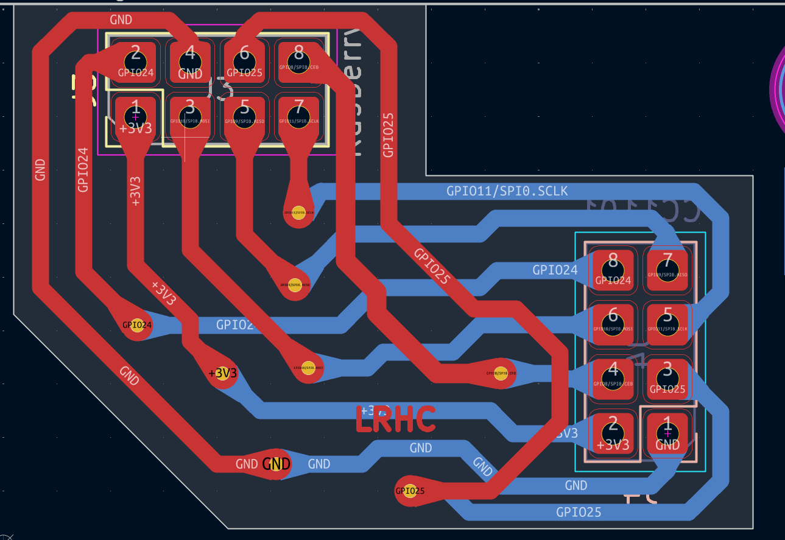
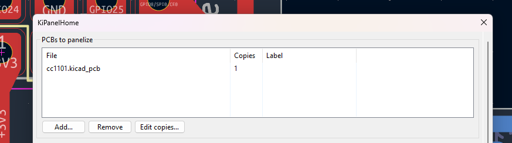
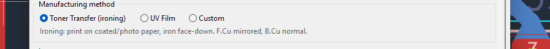
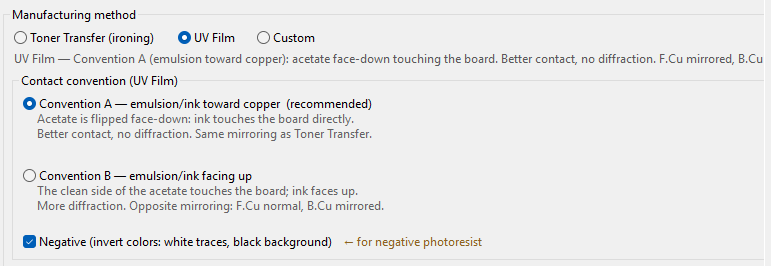
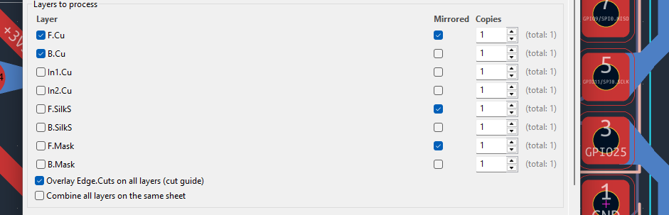
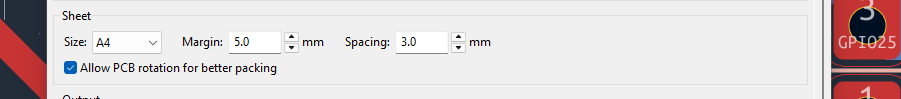
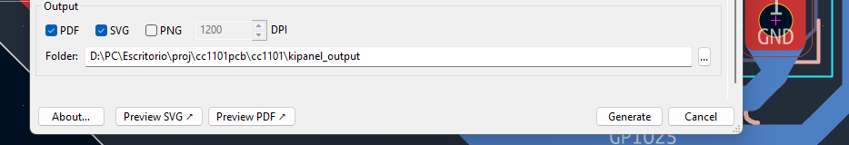
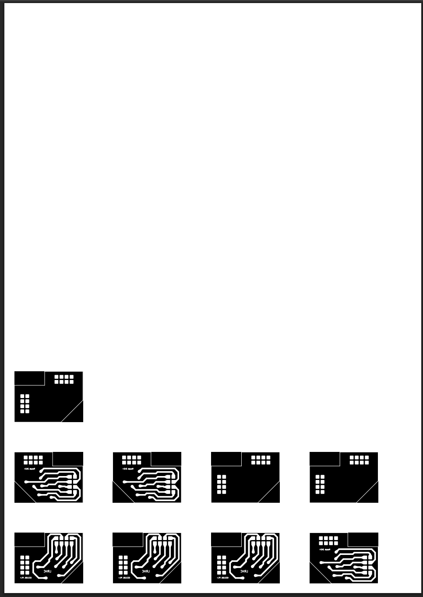
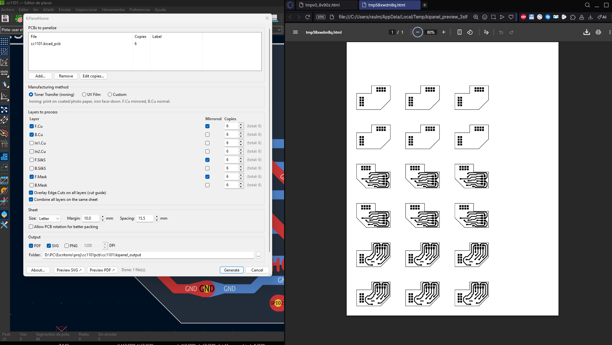
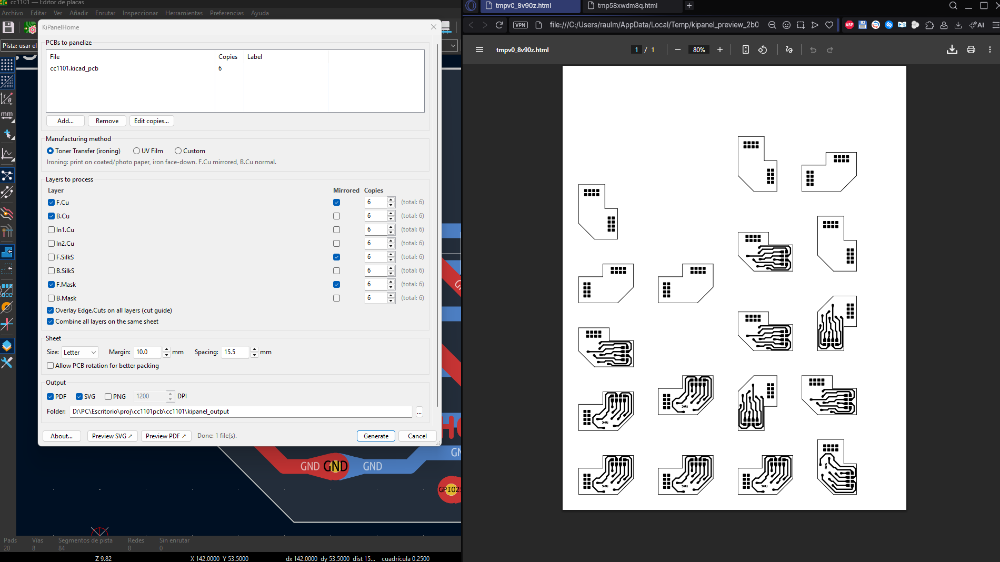

# KiPanelHome

KiCad plugin + herramienta standalone para imprimir múltiples PCBs en una sola hoja a escala 1:1, optimizando el aprovechamiento de papel/acetato para fabricación casera de PCBs.

> **¿Qué tiene de diferente vs KiKit?**
> KiKit es paneling profesional (tabs, mouse bites, V-cuts) para enviar a un fab. KiPanelHome es para imprimir en casa: apila varias PCBs en una hoja A4/Carta/A3 con el espejado correcto según el método de transferencia. Ambas herramientas coexisten sin conflicto.

## Características

- **Bin-packing 2D automático** — coloca el mayor número de copias posible en cada hoja
- **Escala 1:1 garantizada** — nunca reescala, el SVG/PDF sale listo para imprimir
- **Espejado correcto por método**:
  - *Toner transfer (planchado)*: F.Cu espejada, B.Cu normal
  - *Film UV Convención A* (emulsión hacia el cobre, recomendado): igual que planchado
  - *Film UV Convención B* (emulsión hacia arriba): F.Cu normal, B.Cu espejada
  - *Custom*: override manual por capa
- **Modo negativo** para fotorresist negativo (inversión física de colores en SVG)
- **Salida**: PDF, SVG y PNG por capa, una hoja por página si no caben todas
- **Funciona como plugin de KiCad o como herramienta standalone**

## Instalación

### 1. Dependencias Python

```bash
pip install rectpack lxml wxPython
```

> `pcbnew` viene con KiCad, no se instala con pip.
> `cairosvg` es opcional: en Linux/Mac simplifica la conversión a PDF/PNG (`pip install cairosvg`). En Windows se usa Edge/Chrome headless automáticamente.

### 2a. Como plugin de KiCad (recomendado)

```bash
git clone https://github.com/RaulH96/KiPanelHome
cd KiPanelHome
python install_plugin.py
```

El script detecta la versión de KiCad instalada y copia el paquete a la carpeta correcta.

Rutas manuales si prefieres copiar a mano:
- **Windows**: `%APPDATA%\kicad\<version>\scripting\plugins\`
- **Linux**: `~/.config/kicad/<version>/scripting/plugins/`
- **macOS**: `~/Library/Preferences/kicad/<version>/scripting/plugins/`

Luego en KiCad: **Tools → External Plugins → Refresh → KiPanelHome**

### 2b. Standalone en Windows (sin abrir KiCad)

```batch
run_kicad.bat
```

Detecta el Python de KiCad y abre la interfaz gráfica directamente.

### 2c. CLI

```bash
python -m kipanelh.wrappers.cli \
    --pcb mi_placa.kicad_pcb:4 \
    --layers F.Cu,B.Cu \
    --method toner-transfer \
    --sheet A4 --margin 5 --spacing 3 \
    --formats pdf,svg \
    --output ./output/
```

Sintaxis `archivo.kicad_pcb:N` indica N copias de esa PCB.

## Uso desde el plugin

1. Abre una PCB en KiCad
2. **Tools → External Plugins → KiPanelHome**
3. Configura:
   - PCBs a panelizar y número de copias
   - Método de fabricación (toner / film UV / custom)
   - Capas a procesar (F.Cu, B.Cu, SilkS, Mask…)
   - Tamaño de hoja, márgenes y separación entre placas
   - Formato de salida (PDF / SVG / PNG)
4. **Ver SVG ↗** o **Ver PDF ↗** para previsualizar
5. **Generar** para guardar los archivos finales

### Guía visual

**PCB de ejemplo** — placa breakout CC1101 usada en las pruebas:



**Paso 1 — Agregar PCBs:** haz clic en *Add…* y selecciona tus archivos `.kicad_pcb`. Ajusta el número de copias con *Edit copies…*



**Paso 2 — Método de fabricación:** elige Toner Transfer, UV Film o Custom. El espejado correcto se aplica automáticamente.



Con UV Film aparecen opciones de convención de contacto (A/B) y modo negativo para fotorresist negativo:



**Paso 3 — Capas:** activa las capas que quieras imprimir (F.Cu, B.Cu, Mask, SilkS…). La columna *Mirrored* se actualiza sola según el método.



**Paso 4 — Hoja:** elige tamaño (A4/A3/Carta/Custom), margen perimetral y separación entre placas.



**Paso 5 — Salida:** elige formato (PDF/SVG/PNG), carpeta de destino y haz clic en *Preview SVG/PDF* o *Generate*.



#### Ejemplos de salida

**3 copias · Film UV · F.Cu + B.Cu + F.Mask · Modo negativo** (trazas blancas sobre fondo negro):



**6 copias — efecto de la opción "Allow PCB rotation":**

Sin rotación:



Con rotación (mejor aprovechamiento de la hoja):



## Conversión PDF/PNG — por plataforma

| Plataforma | Opción automática | Alternativa |
|---|---|---|
| **Windows** | Edge headless | Instalar Inkscape |
| **Linux** | `pip install cairosvg` | Chromium headless / Inkscape |
| **macOS** | `pip install cairosvg` | Chrome/Edge headless / Inkscape |

## Reglas de espejado (resumen técnico)

KiCad plotea B.Cu desde la vista superior (ya espejada en X). Por eso:

| Método | F.Cu | B.Cu |
|---|---|---|
| Toner Transfer | **espejada** | normal |
| Film UV Conv. A | **espejada** | normal |
| Film UV Conv. B | normal | **espejada** |

Las reglas están validadas con tests unitarios en `tests/test_methods.py`. Si modificas `methods.py`, corre los tests primero — un espejado incorrecto arruina las PCBs.

```bash
python -m pytest tests/
```

## Estructura del proyecto

```
kipanelh/
├── core/
│   ├── models.py       — dataclasses de configuración
│   ├── methods.py      — reglas de espejado por método
│   ├── plotter.py      — generación SVG via pcbnew
│   ├── packer.py       — bin-packing 2D (rectpack)
│   ├── composer.py     — composición SVG/PDF/PNG final
│   └── orchestrator.py — pipeline completo
├── ui/
│   └── main_dialog.py  — interfaz wxPython
└── wrappers/
    ├── cli.py              — CLI (argparse)
    └── kicad_plugin.py     — ActionPlugin de KiCad
install_plugin.py           — instalador automático
run_kicad.bat               — lanzador standalone Windows
run_ui.py                   — entry point UI standalone
```

## Licencia

GPL v3 — Copyright (C) 2026 Luis Raúl Heredia de la Cruz ([@RaulH96](https://github.com/RaulH96))

Libre para usar, modificar y distribuir. Cualquier distribución del código
(modificado o no) debe mantener el código fuente abierto bajo la misma licencia.
Ver [LICENSE](LICENSE) para el texto completo.

---

# KiPanelHome (English)

KiCad plugin + standalone tool to print multiple PCBs on a single sheet at 1:1 scale, making the most of paper/acetate for home PCB manufacturing.

> **How is this different from KiKit?**
> KiKit is professional panelization (tabs, mouse bites, V-cuts) for sending boards to a fab. KiPanelHome is for printing at home: it stacks multiple PCBs onto a single A4/Letter/A3 sheet with the correct mirroring for your transfer method. Both tools coexist without conflict.

## Features

- **Automatic 2D bin-packing** — fits as many copies as possible on each sheet
- **Guaranteed 1:1 scale** — never rescales; the SVG/PDF is ready to print
- **Correct mirroring per method**:
  - *Toner transfer (ironing)*: F.Cu mirrored, B.Cu normal
  - *UV Film Convention A* (emulsion toward copper, recommended): same as toner transfer
  - *UV Film Convention B* (emulsion facing up): F.Cu normal, B.Cu mirrored
  - *Custom*: manual per-layer override
- **Negative mode** for negative photoresist (physical color inversion in SVG)
- **Output**: PDF, SVG and PNG per layer; multiple pages if boards don't fit on one sheet
- **Works as a KiCad plugin or as a standalone tool**

## Installation

### 1. Python dependencies

```bash
pip install rectpack lxml wxPython
```

> `pcbnew` comes with KiCad and is not pip-installable.
> `cairosvg` is optional: on Linux/Mac it simplifies PDF/PNG conversion (`pip install cairosvg`). On Windows, Edge/Chrome headless is used automatically.

### 2a. As a KiCad plugin (recommended)

```bash
git clone https://github.com/RaulH96/KiPanelHome
cd KiPanelHome
python install_plugin.py
```

The script detects your installed KiCad version and copies the package to the correct folder.

Manual paths if you prefer to copy by hand:
- **Windows**: `%APPDATA%\kicad\<version>\scripting\plugins\`
- **Linux**: `~/.config/kicad/<version>/scripting/plugins/`
- **macOS**: `~/Library/Preferences/kicad/<version>/scripting/plugins/`

Then in KiCad: **Tools → External Plugins → Refresh → KiPanelHome**

### 2b. Standalone on Windows (without opening KiCad)

```batch
run_kicad.bat
```

Automatically finds KiCad's Python and opens the GUI directly.

### 2c. CLI

```bash
python -m kipanelh.wrappers.cli \
    --pcb my_board.kicad_pcb:4 \
    --layers F.Cu,B.Cu \
    --method toner-transfer \
    --sheet A4 --margin 5 --spacing 3 \
    --formats pdf,svg \
    --output ./output/
```

Syntax `file.kicad_pcb:N` means N copies of that PCB.

## Using the plugin

1. Open a PCB in KiCad
2. **Tools → External Plugins → KiPanelHome**
3. Configure:
   - PCBs to panelize and number of copies
   - Manufacturing method (toner / UV film / custom)
   - Layers to process (F.Cu, B.Cu, SilkS, Mask…)
   - Sheet size, margins and spacing between boards
   - Output format (PDF / SVG / PNG)
4. **Preview SVG ↗** or **Preview PDF ↗** to preview
5. **Generate** to save the final files

### Visual guide

**Example PCB** — CC1101 breakout board used for testing:


**Step 1 — Add PCBs:** click *Add…* and select your `.kicad_pcb` files. Adjust copy count with *Edit copies…*


**Step 2 — Manufacturing method:** choose Toner Transfer, UV Film, or Custom. Correct mirroring is applied automatically.


With UV Film, contact convention (A/B) and negative mode options appear:


**Step 3 — Layers:** enable the layers you want to print (F.Cu, B.Cu, Mask, SilkS…). The *Mirrored* column updates automatically based on the chosen method.


**Step 4 — Sheet:** choose size (A4/A3/Letter/Custom), perimeter margin, and spacing between boards.


**Step 5 — Output:** choose format (PDF/SVG/PNG), output folder, then click *Preview SVG/PDF* or *Generate*.


#### Output examples

**3 copies · UV Film · F.Cu + B.Cu + F.Mask · Negative mode** (white traces on black background):


**6 copies — effect of "Allow PCB rotation":**

Without rotation:


With rotation (better sheet utilization):


## PDF/PNG conversion — by platform

| Platform | Automatic option | Alternative |
|---|---|---|
| **Windows** | Edge headless | Install Inkscape |
| **Linux** | `pip install cairosvg` | Chromium headless / Inkscape |
| **macOS** | `pip install cairosvg` | Chrome/Edge headless / Inkscape |

## Mirror rules (technical summary)

KiCad plots B.Cu from the top view (already mirrored in X). Therefore:

| Method | F.Cu | B.Cu |
|---|---|---|
| Toner Transfer | **mirrored** | normal |
| UV Film Conv. A | **mirrored** | normal |
| UV Film Conv. B | normal | **mirrored** |

The rules are validated with unit tests in `tests/test_methods.py`. If you modify `methods.py`, run the tests first — incorrect mirroring ruins PCBs.

```bash
python -m pytest tests/
```

## Project structure

```
kipanelh/
├── core/
│   ├── models.py       — configuration dataclasses
│   ├── methods.py      — mirror rules per method
│   ├── plotter.py      — SVG generation via pcbnew
│   ├── packer.py       — 2D bin-packing (rectpack)
│   ├── composer.py     — final SVG/PDF/PNG composition
│   └── orchestrator.py — full pipeline
├── ui/
│   └── main_dialog.py  — wxPython interface
└── wrappers/
    ├── cli.py              — CLI (argparse)
    └── kicad_plugin.py     — KiCad ActionPlugin
install_plugin.py           — automatic installer
run_kicad.bat               — Windows standalone launcher
run_ui.py                   — standalone UI entry point
```

## License

GPL v3 — Copyright (C) 2026 Luis Raúl Heredia de la Cruz ([@RaulH96](https://github.com/RaulH96))

Free to use, modify and distribute. Any distribution of the code (modified or not)
must keep the source open under the same license.
See [LICENSE](LICENSE) for the full text.
